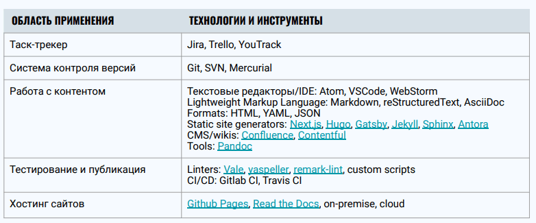

# Стайлгайды
Локальный стайлгайд (наши):
* [Рекомендации по написанию пользовательской документации](https://wiki.parcsis.org/pages/viewpage.action?pageId=30540003)
* [Help styleguide](https://wiki.parcsis.org/display/DOC/Help+styleguide)

Локальные стайлгайды крупных компаний:
* [Google](https://developers.google.com/style)
* [Microsoft](https://learn.microsoft.com/en-us/style-guide/welcome/)
* [Mailchimp](https://styleguide.mailchimp.com/)

Глобальные стайлгайды:
* [AP Stylebook](https://store.stylebooks.com)
* [Chicago Manual of Style](https://www.chicagomanualofstyle.org/home.html)

Некоторые также причисляют ГОСТ к глобальным стайлгайдам.

Фундаментальные источники истины:
* [Merriam-Webster](https://www.merriam-webster.com/)
* [Справочник Розенталя](http://rosental-book.ru/)
* [gramota.ru](http://gramota.ru/?ysclid=lgxprmjomo548240227)
* "Справочник издателя и автора" Мильчина и Чельцовой 

# Принципы документирования Doc as Code

**Docs as Code** (документация как код) — подход к созданию контента, который подразумевает автоматизацию процесса с помощь теж же инструментов, что и создание программного кода.

* Исходные файлы + система контроля версий + автоматизированный процесс тестирования и публикации.
* Рассматривая документацию как продукт, мы можем применить к ней те же подходы, что и разработке программного обеспечения.
* У документации как у продукта есть свои функциональные возможности, архитектура, нефункциональные требования, бэклог задач, технический долг.

**Технологический стек**

(c)Xsolla

**У нас:**

* Технологический стек: 
  * **Html-справка**: Asciidoctor + Hugo + GitLab + публикация на серверах компании
  * **Мануалы в PDF**: Asciidoctor + AsciidoctorPDF + GitLab + публикация Wiki
  * **Мануалы в DOCX,ODT** (не публикуются, передаются по запросу): Asciidoctor + [CourseOrchestra](https://github.com/CourseOrchestra/asciidoctor-open-document) + Docker + GitLab
* Help: https://help.doc.one и https://help.bot.one
* Help feedback: https://app.happyreact.com/login
* Help analitics: Google Аналитика - https://analytics.google.com/analytics/web/?hl=ru#/p267174245/reports/intelligenthome

Сервисы для работы с документацией:
* Текстовый редактор: Word, Odt, Google Docs
* Графический редактор: FastStone Picture, Adobe Photoshop
